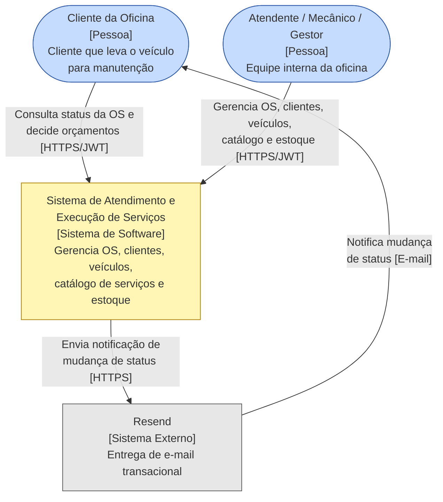
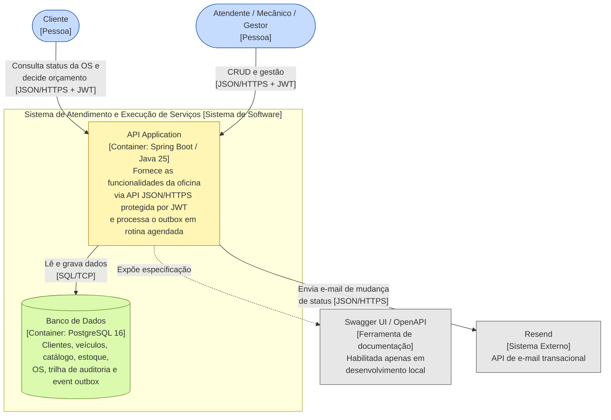

# Modelo C4

Visões de arquitetura do sistema em três níveis: contexto, containers e componentes.
As decisões que sustentam estas visões estão em [docs/adr](adr) — em especial a
[ADR-001](adr/ADR-001-vertical-slice-architecture.md), que define as fatias verticais com
Clean Architecture, e a [ADR-004](adr/ADR-004-transactional-outbox-audit-notifications.md),
que define o Transactional Outbox para auditoria e notificações.

## Nível 1 — Contexto

O cliente é um usuário autenticado do sistema: consulta o status da própria OS e registra a
aprovação ou recusa do orçamento pela API. A notificação de mudança de status sai por e-mail
através do Resend e é opcional — fica desabilitada quando não há credenciais configuradas.

## Nível 2 — Containers

A aplicação é um monólito modular: um único container de processo hospeda todas as fatias
verticais e as rotinas agendadas que drenam o `event_outbox`. O schema é versionado por Flyway.

## Nível 3 — Componentes da API Application

```mermaid
flowchart TD
    classDef controller fill:#c6dcff,stroke:#305bab
    classDef service fill:#fff6b6,stroke:#af7e02
    classDef domain fill:#adf0c7,stroke:#087429
    classDef port fill:#ffd9b3,stroke:#b35c00
    classDef infra fill:#e7e7e7,stroke:#595959
    classDef db fill:#dbfaad,stroke:#608520

    subgraph API["API Application [Container: Spring Boot]"]
        direction TB

        jwtFilter["JWT Auth Filter<br/>[Componente]<br/>Autentica a requisição antes<br/>de alcançar os controllers"]:::infra

        subgraph Apresentacao["Adapter IN — Web"]
            authCtrl["Auth / UserAccount Controller<br/>[Controller]<br/>Login e contas de acesso"]:::controller
            osCtrl["ServiceOrder Controller<br/>[Controller]<br/>Endpoints de Ordem de Serviço"]:::controller
            clienteCtrl["Customer Controller<br/>[Controller]"]:::controller
            veiculoCtrl["Vehicle Controller<br/>[Controller]"]:::controller
            catalogoCtrl["ServiceCatalog Controller<br/>[Controller]"]:::controller
            estoqueCtrl["Inventory Controller<br/>[Controller]"]:::controller
        end

        subgraph Aplicacao["Application — Casos de Uso"]
            authSvc["Auth Services<br/>[Componente]<br/>Autenticação, contas e roles"]:::service
            osSvc["ServiceOrder Services<br/>[Componente]<br/>Abertura, status e fila operacional"]:::service
            orcamentoSvc["DecideEstimateService<br/>[Componente]<br/>Aprovação ou recusa idempotente"]:::service
            clienteSvc["Customer Services<br/>[Componente]"]:::service
            veiculoSvc["Vehicle Services<br/>[Componente]"]:::service
            catalogoSvc["ServiceCatalog Services<br/>[Componente]"]:::service
            estoqueSvc["Inventory Services<br/>[Componente]<br/>Reposição, reserva e baixa"]:::service
        end

        subgraph Dominio["Domain — Regras de Negócio"]
            osAgg["ServiceOrder + Estimate<br/>[Agregado]<br/>Transições de status"]:::domain
            clienteEnt["Customer + TaxId<br/>[Entidade + VO]<br/>Validação de CPF/CNPJ"]:::domain
            veiculoEnt["Vehicle + LicensePlate<br/>[Entidade + VO]<br/>Validação de placa"]:::domain
            catalogoEnt["ServiceCatalogItem<br/>[Entidade]"]:::domain
            pecaEnt["InventoryItem + Stock<br/>[Entidade + VO]<br/>Quantidade nunca negativa"]:::domain
        end

        subgraph Portas["Application — Portas de Saída"]
            repoPorts["Repository Ports<br/>[Interfaces]"]:::port
            outPorts["AuditTrailPort /<br/>StatusNotificationPort<br/>[Interfaces]"]:::port
        end

        subgraph Infra["Adapter OUT — Infraestrutura"]
            persist["Persistence Adapters<br/>[Componente: JPA]"]:::infra
            outbox["Event Outbox Publisher<br/>[Componente]<br/>Grava o evento na mesma transação"]:::infra
            processors["Outbox Processors<br/>[Componente: rotina agendada]<br/>Trilha de auditoria e e-mail"]:::infra
        end
    end

    db[("Banco de Dados<br/>[Container: PostgreSQL]")]:::db
    resend["Resend<br/>[Sistema Externo]"]:::infra

    jwtFilter --> Apresentacao

    authCtrl --> authSvc
    osCtrl --> osSvc
    osCtrl --> orcamentoSvc
    clienteCtrl --> clienteSvc
    veiculoCtrl --> veiculoSvc
    catalogoCtrl --> catalogoSvc
    estoqueCtrl --> estoqueSvc

    osSvc --> osAgg
    orcamentoSvc --> osAgg
    clienteSvc --> clienteEnt
    veiculoSvc --> veiculoEnt
    catalogoSvc --> catalogoEnt
    estoqueSvc --> pecaEnt

    osSvc -.->|"captura o preço<br/>na abertura da OS"| catalogoSvc
    osSvc -.->|"reserva material<br/>na abertura da OS"| estoqueSvc

    Aplicacao --> repoPorts
    Aplicacao --> outPorts

    persist -.->|implementa| repoPorts
    outbox -.->|implementa| outPorts

    persist -->|"[SQL/TCP]"| db
    outbox -->|"[SQL/TCP]"| db
    processors -->|"drena event_outbox<br/>[SQL/TCP]"| db
    processors -->|"[JSON/HTTPS]"| resend
```

