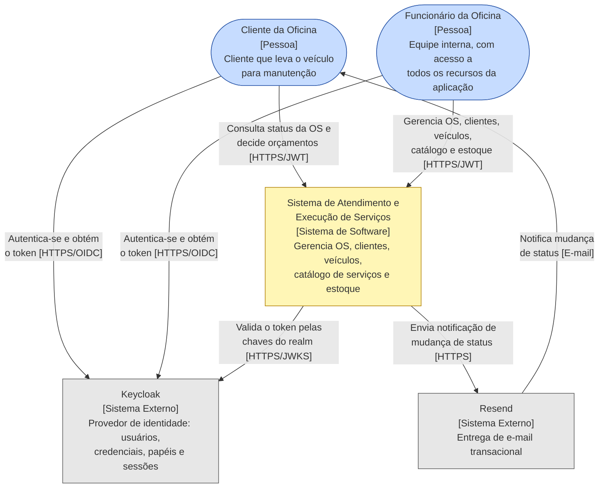
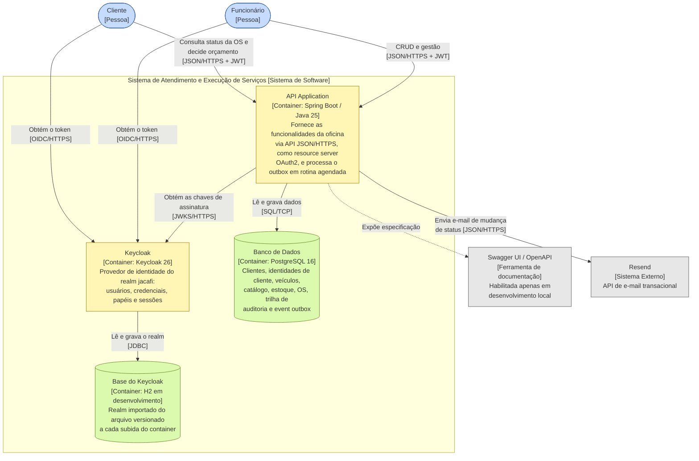

# Modelo C4

Visões de arquitetura do sistema em três níveis: contexto, containers e componentes.
As decisões que sustentam estas visões estão em [docs/adr](adr) — em especial a
[ADR-001](adr/ADR-001-vertical-slice-architecture.md), que define as fatias verticais com
Clean Architecture, a [ADR-004](adr/ADR-004-transactional-outbox-audit-notifications.md),
que define o Transactional Outbox para auditoria e notificações, e a
[ADR-005](adr/ADR-005-keycloak-identity-provider.md), que delega a identidade ao Keycloak e
reduz os papéis a `EMPLOYEE` e `CUSTOMER`.

Para melhor visualização, os diagramas também estão disponíveis no [quadro no Miro](https://miro.com/app/board/uXjVNQGY9hA=/?share_link_id=579203101734).

## Nível 1 — Contexto

```mermaid
flowchart TD
    classDef person fill:#c6dcff,stroke:#305bab
    classDef system fill:#fff6b6,stroke:#af7e02
    classDef ext fill:#e7e7e7,stroke:#595959

    cliente(["Cliente da Oficina<br/>[Pessoa]<br/>Cliente que leva o veículo<br/>para manutenção"]):::person
    funcionario(["Funcionário da Oficina<br/>[Pessoa]<br/>Equipe interna, com acesso a<br/>todos os recursos da aplicação"]):::person
    sistema["Sistema de Atendimento e<br/>Execução de Serviços<br/>[Sistema de Software]<br/>Gerencia OS, clientes, veículos,<br/>catálogo de serviços e estoque"]:::system
    idp["Keycloak<br/>[Sistema Externo]<br/>Provedor de identidade: usuários,<br/>credenciais, papéis e sessões"]:::ext
    email["Resend<br/>[Sistema Externo]<br/>Entrega de e-mail transacional"]:::ext

    cliente -->|"Autentica-se e obtém<br/>o token [HTTPS/OIDC]"| idp
    funcionario -->|"Autentica-se e obtém<br/>o token [HTTPS/OIDC]"| idp
    cliente -->|"Consulta status da OS e<br/>decide orçamentos [HTTPS/JWT]"| sistema
    funcionario -->|"Gerencia OS, clientes, veículos,<br/>catálogo e estoque [HTTPS/JWT]"| sistema
    sistema -->|"Valida o token pelas<br/>chaves do realm [HTTPS/JWKS]"| idp
    sistema -->|"Envia notificação de<br/>mudança de status [HTTPS]"| email
    email -->|"Notifica mudança<br/>de status [E-mail]"| cliente
```

O cliente é um usuário autenticado do sistema: consulta o status da própria OS e registra a
aprovação ou reprovação do orçamento pela API. A notificação de mudança de status sai por e-mail
através do Resend e é opcional — fica desabilitada quando não há credenciais configuradas.

A autenticação não é responsabilidade do sistema. O Keycloak emite os tokens, e a aplicação
apenas os valida: não guarda senha, não emite token e não expõe cadastro de usuário. Cabe à
aplicação somente decidir o que cada papel alcança. São dois papéis: `EMPLOYEE`, que alcança
todos os recursos da oficina, e `CUSTOMER`, restrito aos próprios dados.

## Nível 2 — Containers

```mermaid
flowchart TD
    classDef person fill:#c6dcff,stroke:#305bab
    classDef container fill:#fff6b6,stroke:#af7e02
    classDef db fill:#dbfaad,stroke:#608520
    classDef ext fill:#e7e7e7,stroke:#595959

    cliente(["Cliente<br/>[Pessoa]"]):::person
    funcionario(["Funcionário<br/>[Pessoa]"]):::person

    subgraph Sistema["Sistema de Atendimento e Execução de Serviços [Sistema de Software]"]
        api["API Application<br/>[Container: Spring Boot / Java 25]<br/>Fornece as funcionalidades da oficina<br/>via API JSON/HTTPS, como resource server<br/>OAuth2, e processa o outbox em rotina agendada"]:::container
        idp["Keycloak<br/>[Container: Keycloak 26]<br/>Provedor de identidade do realm jacafi:<br/>usuários, credenciais, papéis e sessões"]:::container
        db[("Banco de Dados<br/>[Container: PostgreSQL 16]<br/>Clientes, identidades de cliente, veículos,<br/>catálogo, estoque, OS, trilha de<br/>auditoria e event outbox")]:::db
        idpDb[("Base do Keycloak<br/>[Container: H2 em desenvolvimento]<br/>Realm importado do arquivo versionado<br/>a cada subida do container")]:::db
    end

    docs["Swagger UI / OpenAPI<br/>[Ferramenta de documentação]<br/>Habilitada apenas em<br/>desenvolvimento local"]:::ext
    resend["Resend<br/>[Sistema Externo]<br/>API de e-mail transacional"]:::ext

    cliente -->|"Obtém o token [OIDC/HTTPS]"| idp
    funcionario -->|"Obtém o token [OIDC/HTTPS]"| idp
    cliente -->|"Consulta status da OS e<br/>decide orçamento [JSON/HTTPS + JWT]"| api
    funcionario -->|"CRUD e gestão<br/>[JSON/HTTPS + JWT]"| api
    api -->|"Obtém as chaves de assinatura<br/>[JWKS/HTTPS]"| idp
    api -->|"Lê e grava dados<br/>[SQL/TCP]"| db
    idp -->|"Lê e grava o realm<br/>[JDBC]"| idpDb
    api -->|"Envia e-mail de mudança<br/>de status [JSON/HTTPS]"| resend
    api -.->|"Expõe especificação"| docs
```

A aplicação é um monólito modular: um único container de processo hospeda todas as fatias
verticais e as rotinas agendadas que drenam o `event_outbox`. O schema é versionado por Flyway.

O Keycloak é um container à parte, com base própria. Não há segredo compartilhado entre ele e
a API: a validação do token usa as chaves públicas do realm. O `issuer` que o Keycloak emite é
o endereço público visto pelo navegador, enquanto a API busca o JWKS pelo endereço interno da
rede — por isso `issuer-uri` e `jwk-set-uri` são configurados separadamente. Em desenvolvimento
o realm é importado de [keycloak/jacafi-realm.json](../keycloak/jacafi-realm.json) a cada
subida, e a base do Keycloak não é persistida: o arquivo versionado é a única fonte da verdade.

## Nível 3 — Componentes da API Application

```mermaid
flowchart TD
    classDef controller fill:#c6dcff,stroke:#305bab
    classDef service fill:#fff6b6,stroke:#af7e02
    classDef domain fill:#adf0c7,stroke:#087429
    classDef port fill:#ffd9b3,stroke:#b35c00
    classDef infra fill:#e7e7e7,stroke:#595959
    classDef db fill:#dbfaad,stroke:#608520

    subgraph API["API Application [Container: Spring Boot]"]
        direction TB

        subgraph Seguranca["Adapter IN — Segurança"]
            resourceServer["OAuth2 Resource Server<br/>[Componente: Spring Security]<br/>Valida assinatura, expiração e issuer<br/>do token antes dos controllers"]:::infra
            converter["Keycloak JWT Converter<br/>[Componente]<br/>Traduz realm_access.roles em<br/>EMPLOYEE/CUSTOMER e resolve o<br/>cliente do sub, uma vez por requisição"]:::infra
        end

        subgraph Apresentacao["Adapter IN — Web"]
            osCtrl["ServiceOrder Controller<br/>[Controller]<br/>Endpoints de Ordem de Serviço"]:::controller
            clienteCtrl["Customer Controller<br/>[Controller]<br/>Cadastro, perfil e vínculo<br/>de identidade"]:::controller
            veiculoCtrl["Vehicle Controller<br/>[Controller]"]:::controller
            catalogoCtrl["LaborOperation Controller<br/>[Controller]"]:::controller
            estoqueCtrl["Inventory Controller<br/>[Controller]"]:::controller
        end

        subgraph Aplicacao["Application — Casos de Uso"]
            policies["Access Policies<br/>[Componente: uma por fatia]<br/>Consultada por todos os casos de uso<br/>da fatia: exige o papel e, para o<br/>cliente, a posse do dado"]:::service
            osSvc["ServiceOrder Services<br/>[Componente]<br/>Abertura, status e fila operacional"]:::service
            orcamentoSvc["ApproveEstimateService /<br/>RejectEstimateService<br/>[Componente]<br/>Aprovação ou reprovação idempotente"]:::service
            clienteSvc["Customer Services<br/>[Componente]<br/>Inclui o vínculo identidade–cliente"]:::service
            veiculoSvc["Vehicle Services<br/>[Componente]"]:::service
            catalogoSvc["LaborOperation Services<br/>[Componente]"]:::service
            estoqueSvc["Inventory Services<br/>[Componente]<br/>Reposição, reserva e baixa"]:::service
        end

        subgraph Dominio["Domain — Regras de Negócio"]
            osAgg["ServiceOrder + Estimate<br/>[Agregado]<br/>Transições de status"]:::domain
            clienteEnt["Customer + TaxId<br/>[Entidade + VO]<br/>Validação de CPF/CNPJ"]:::domain
            veiculoEnt["Vehicle + LicensePlate<br/>[Entidade + VO]<br/>Validação de placa"]:::domain
            catalogoEnt["LaborOperation<br/>[Entidade]"]:::domain
            pecaEnt["InventoryItem + Stock<br/>[Entidade + VO]<br/>Quantidade nunca negativa"]:::domain
        end

        subgraph Portas["Application — Portas de Saída"]
            repoPorts["Repository Ports<br/>[Interfaces]"]:::port
            outPorts["AuditTrailPort /<br/>StatusNotificationPort<br/>[Interfaces]"]:::port
            secPorts["CurrentAuthenticatedUserPort /<br/>CustomerIdentityPort<br/>[Interfaces: shared/security]"]:::port
        end

        subgraph Infra["Adapter OUT — Infraestrutura"]
            persist["Persistence Adapters<br/>[Componente: JPA]"]:::infra
            identity["Customer Identity Adapter<br/>[Componente: JPA]<br/>Resolve o sub do Keycloak para<br/>o cadastro de cliente"]:::infra
            outbox["Event Outbox Publisher<br/>[Componente]<br/>Grava o evento na mesma transação"]:::infra
            processors["Outbox Processors<br/>[Componente: rotina agendada]<br/>Trilha de auditoria e e-mail"]:::infra
        end
    end

    idp["Keycloak<br/>[Container]"]:::infra
    db[("Banco de Dados<br/>[Container: PostgreSQL]")]:::db
    resend["Resend<br/>[Sistema Externo]"]:::infra

    resourceServer -->|"token válido"| converter
    resourceServer -->|"obtém as chaves<br/>[JWKS/HTTPS]"| idp
    converter --> Apresentacao

    osCtrl --> osSvc
    osCtrl --> orcamentoSvc
    clienteCtrl --> clienteSvc
    veiculoCtrl --> veiculoSvc
    catalogoCtrl --> catalogoSvc
    estoqueCtrl --> estoqueSvc

    osSvc --> osAgg
    orcamentoSvc --> osAgg
    clienteSvc --> clienteEnt
    veiculoSvc --> veiculoEnt
    catalogoSvc --> catalogoEnt
    estoqueSvc --> pecaEnt

    osSvc -.->|"captura o preço<br/>na abertura da OS"| catalogoSvc
    osSvc -.->|"reserva material<br/>na abertura da OS"| estoqueSvc

    Aplicacao --> repoPorts
    Aplicacao --> outPorts
    policies -->|"lê quem está autenticado"| secPorts
    converter -.->|"consulta o vínculo"| secPorts

    persist -.->|implementa| repoPorts
    identity -.->|implementa| secPorts
    outbox -.->|implementa| outPorts

    persist -->|"[SQL/TCP]"| db
    identity -->|"[SQL/TCP]"| db
    outbox -->|"[SQL/TCP]"| db
    processors -->|"drena event_outbox<br/>[SQL/TCP]"| db
    processors -->|"[JSON/HTTPS]"| resend
```

Não há mais fatia de autenticação: no lugar do filtro JWT próprio, do controller de login e do
CRUD de contas, ficam apenas dois componentes de borda — o resource server, que valida o token,
e o conversor, que traduz os papéis do realm para o enum de domínio.

O que permanece na aplicação é o que não é identidade. As `Access Policies` de cada fatia
decidem a autorização de domínio — o papel exigido e, no caso do cliente, a posse do dado
consultado, como em "o cliente só lê a própria OS". Elas leem quem está autenticado pela
`CurrentAuthenticatedUserPort`, sem conhecer o Keycloak. E o vínculo entre a identidade e o
cadastro de cliente é um fato da oficina: vive na tabela `customer_identities`, com chave no
`sub` do Keycloak e índice único por cliente, e é estabelecido por um funcionário através do
`Customer Controller`. O conversor resolve esse vínculo uma vez por requisição, de modo que as
políticas recebem o `customerId` já pronto.
