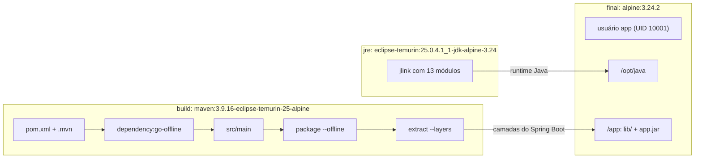

# Dockerfile da API

O [Dockerfile](../../server/Dockerfile) gera a imagem da API Spring Boot executada pelo [docker-compose.yaml](../../docker-compose.yaml). Este documento descreve como ele está organizado e por que cada escolha foi feita, com foco em desempenho do build e segurança da imagem.

Os números foram medidos em 02/10/2026, em build local, comparando com a imagem gerada pelo Dockerfile anterior (estágio único de runtime sobre `eclipse-temurin:25-jre`, com Ubuntu).

```bash
docker build -t jacafi-server server                     # somente a imagem
docker compose --env-file .env.example up -d --build     # stack completa
```

## Visão geral

O build tem três estágios. Os dois primeiros existem apenas durante o build; a imagem publicada é o terceiro, que recebe somente o resultado dos anteriores.



| Estágio | Base | Responsabilidade | O que chega à imagem final |
|---|---|---|---|
| `build` | `maven:3.9.16-eclipse-temurin-25-alpine` | baixa dependências, compila e separa o jar em camadas | as camadas extraídas |
| `jre` | `eclipse-temurin:25.0.4.1_1-jdk-alpine-3.24` | gera um runtime Java reduzido com `jlink` | o diretório `/runtime`, copiado como `/opt/java` |
| final | `alpine:3.24.2` | executa a aplicação | é a imagem |

A imagem final contém o Alpine (musl, busybox e `apk`), o runtime Java com 13 módulos, as dependências em `/app/lib` e o `app.jar`. Não contém Maven, JDK (`javac`, `jlink`, `jdeps`), código-fonte, testes, `curl`, variáveis de configuração nem segredos.

## Estágio a estágio

### `build`

- O Maven da imagem (3.9.16) é a mesma versão fixada em `.mvn/wrapper/maven-wrapper.properties`, para que o build da imagem e o `./mvnw` local se comportem igual.
- `.mvn/maven.config` e `.mvn/settings.xml` são copiados porque o primeiro passa `-s .mvn/settings.xml` ao Maven, e o segundo aponta para o Maven Central.
- O `pom.xml` entra antes do código, e as dependências são baixadas por `dependency:go-offline` numa camada própria (ver [Cache de camadas](#cache-de-camadas)).
- O `package` roda com `--offline`: tudo de que ele precisa já veio no `go-offline`. Se faltar algo, o build falha de forma visível, em vez de baixar silenciosamente numa camada que é refeita a cada commit.
- `-Dmaven.test.skip=true` pula a compilação e a execução dos testes. Os testes de integração precisam de Docker (Testcontainers), que não existe dentro do build.
- `-Dspotless.check.skip`, `-Dcheckstyle.skip`, `-Denforcer.skip` e `-Djacoco.skip` desligam as verificações de qualidade. Elas são portões do pipeline (`mvn verify`), não etapas de empacotamento. Por isso apenas `src/main` é copiado, e `config/` (regras do Checkstyle) fica fora da imagem.
- `java -Djarmode=tools -jar ... extract --layers` desmonta o fat jar do Spring Boot em quatro diretórios, separados pela frequência com que mudam. `--application-filename app.jar` fixa o nome do jar, independente da versão no `pom.xml`. O Dockerfile anterior copiava `*-SNAPSHOT.jar` e quebraria na primeira versão de release.

| Camada | Conteúdo | Tamanho | Muda quando |
|---|---|---|---|
| `dependencies` | jars de terceiros com versão de release | 66 MB | uma dependência do `pom.xml` muda |
| `spring-boot-loader` | launcher do Spring Boot | vazia | só é preenchida com a opção `--launcher` |
| `snapshot-dependencies` | dependências `-SNAPSHOT` | vazia hoje | uma dependência SNAPSHOT muda |
| `application` | `app.jar` com as classes e os recursos do projeto | 360 KB | a cada commit |

As camadas vazias são copiadas mesmo assim, para que o Dockerfile continue correto quando surgir uma dependência SNAPSHOT.

### `jre`

O JDK tem dezenas de módulos; a aplicação usa 13. O `jlink` monta um runtime apenas com eles, levantados pelo `jdeps` (ver [Manutenção](#atualizar-a-lista-de-módulos-do-jlink)).

| Opção | Efeito |
|---|---|
| `--strip-debug` | remove a informação de debug das classes do JDK; frames do JDK perdem o número de linha no stack trace, os da aplicação não |
| `--no-man-pages`, `--no-header-files` | descartam arquivos úteis apenas para desenvolvimento |
| `--compress=zip-6` | comprime o arquivo `lib/modules`: o runtime cai de 97 MB para 63 MB, ao custo de descomprimir as classes do JDK ao carregá-las |
| `--output /runtime` | `/opt/java` já existe na imagem do Temurin; o destino final é definido no `COPY` |

A lista de módulos é fixa no Dockerfile, e não calculada a cada build. Se o `jdeps` rodasse no build, o estágio `jre` passaria a depender do jar da aplicação e seria refeito a cada commit, junto com a camada de 66 MB que ele produz. Com a lista fixa, ele só é refeito quando a imagem base muda.

O runtime gerado usa a musl, a biblioteca C do Alpine. Por isso as três bases são Alpine na mesma versão (3.24): o runtime é gerado e executado sobre a mesma biblioteca.

### Final

| Instrução | Por quê |
|---|---|
| `# syntax=docker/dockerfile:1.27.1` | fixa a versão do frontend do BuildKit que interpreta o Dockerfile; o build local e o do pipeline usam o mesmo parser, independente do Docker instalado |
| `LABEL org.opencontainers.image.*` | metadados OCI: `source` liga a imagem ao repositório em registries como o GHCR, `licenses` declara a licença MIT |
| `RUN addgroup ... adduser ...` | cria o usuário sem privilégio (ver [Usuário sem privilégio](#usuário-sem-privilégio)) |
| `COPY --from=jre /runtime /opt/java` | traz apenas o runtime Java reduzido |
| quatro `COPY --from=build` | uma camada por diretório extraído, na ordem do que muda menos para o que muda mais |
| `USER 10001:10001` | o processo nunca roda como root |
| `EXPOSE 8082` | apenas documenta a porta; a porta real vem de `SERVER_PORT` |
| `ENTRYPOINT ["/opt/java/bin/java", "-jar", "app.jar"]` | forma exec: o Java é o PID 1 e recebe o `SIGTERM` do `docker stop` diretamente, sem shell intermediário, e o desligamento gracioso do Spring Boot funciona; o caminho absoluto dispensa `ENV PATH` e `JAVA_HOME` |

O `java -jar app.jar` roda sobre o layout extraído: o manifesto do `app.jar` lista os jars de `lib/` no `Class-Path`, e a JVM os lê direto do disco. Isso evita que o launcher do Spring Boot leia jars aninhados dentro do fat jar a cada inicialização. A aplicação inicia em 5,4 s.

## Desempenho

### Cache de camadas

O Docker reaproveita uma camada enquanto a instrução e tudo que veio antes dela permanecem iguais. As instruções estão ordenadas do que muda menos para o que muda mais: primeiro `pom.xml` e `.mvn` com o `go-offline`, que só é refeito quando as dependências mudam; depois `src/main` e o `package`, refeitos a cada commit.

Medido após alterar apenas um arquivo em `src/main`:

- `go-offline`, `jlink` e a criação do usuário vieram do cache;
- o rebuild levou 8,5 s;
- das 8 camadas da imagem final, apenas `application` (360 KB) mudou. O runtime Java (66 MB) e as dependências (66 MB) mantiveram o mesmo digest.

Num registry, camadas de mesmo digest não são reenviadas: o push e o pull de uma versão nova transferem cerca de 360 KB, não a imagem inteira.

Runners de CI costumam começar sem cache. Para aproveitá-lo no pipeline, o cache do BuildKit precisa ser exportado e importado, por exemplo:

```bash
docker buildx build \
  --cache-from type=registry,ref=<registry>/jacafi-server:buildcache \
  --cache-to type=registry,ref=<registry>/jacafi-server:buildcache,mode=max \
  -t <registry>/jacafi-server:<versão> server
```

`mode=max` inclui as camadas dos estágios `build` e `jre`, que não fazem parte da imagem final; sem ele, o `go-offline` e o `jlink` seriam refeitos em todo build.

O repositório Maven fica dentro da camada do `go-offline`, e não num `RUN --mount=type=cache`. Um cache mount fica fora das camadas e não é exportado pelo `--cache-to`: num runner novo, o `go-offline` viria do cache de camadas, mas o `package --offline` encontraria o `~/.m2` vazio. A camada funciona igual na máquina local e em CI.

### Contexto de build

O [.dockerignore](../../server/.dockerignore) é uma lista de permissão: exclui tudo (`*`) e libera apenas `pom.xml`, `.mvn/maven.config`, `.mvn/settings.xml` e `src/main/`. O contexto enviado ao builder fica pequeno, sem `target/` nem `.idea/`, e alterações em testes, documentação ou configuração de IDE não invalidam o cache do `COPY src/main`.

### Estágios paralelos e download das bases

O BuildKit executa `build` e `jre` em paralelo, porque um não depende do outro. As três bases compartilham camadas (`alpine:3.24.2` está contida na `eclipse-temurin`, que está contida na `maven`), então baixar as três custa o mesmo que baixar só a do Maven.

### Tamanho

| | Antes | Depois |
|---|---|---|
| Base do runtime | `eclipse-temurin:25-jre` (Ubuntu 26.04) | `alpine:3.24.2` |
| Runtime Java | JRE completo | `jlink` com 13 módulos, 63 MB (o JRE completo do Temurin para Alpine ocupa 190 MB) |
| Espaço em disco (`docker images`) | 615 MB | 246 MB |
| Conteúdo transferido em push e pull | 181 MB | 105 MB |

Camadas da imagem final:

| Camada | Tamanho |
|---|---|
| Alpine 3.24.2 | 9,1 MB |
| usuário `app` | 33 KB |
| runtime Java (`/opt/java`) | 66 MB |
| `dependencies` | 66 MB |
| `spring-boot-loader` e `snapshot-dependencies` | vazias |
| `application` | 369 KB |

## Segurança

### Imagens oficiais com versão exata

- As três bases são Docker Official Images (`maven`, `eclipse-temurin`, `alpine`), mantidas pelo Docker Hub com os publicadores e reconstruídas quando sai uma correção.
- As tags são exatas, nunca `latest` nem só a versão principal (`25-jre`). O mesmo Dockerfile gera a mesma base hoje e daqui a seis meses, e cada atualização vira uma mudança revisável no pull request. A contrapartida é que correções das bases não chegam sozinhas (ver [Atualizar as imagens base](#atualizar-as-imagens-base)).
- Fixar também o digest (`alpine:3.24.2@sha256:...`) protegeria contra uma tag republicada. Fica como evolução para quando o repositório tiver Renovate ou Dependabot para atualizá-los.

### Superfície de ataque mínima

O que não está na imagem não pode ser explorado nem precisa de correção. A imagem final não tem compilador, Maven, JDK, `curl`, código-fonte nem testes; restam o busybox do Alpine (shell e `wget`, usados pelo healthcheck do Compose) e o `apk`. O runtime Java tem apenas os 13 módulos que a aplicação usa.

O efeito aparece no scan: os pacotes do sistema operacional passaram de 243 vulnerabilidades para nenhuma (ver [Varredura de vulnerabilidades](#varredura-de-vulnerabilidades)).

### Usuário sem privilégio

```dockerfile
RUN addgroup -S -g 10001 app \
    && adduser -S -D -H -u 10001 -G app -h /app -s /sbin/nologin app
USER 10001:10001
```

- `-S` cria um usuário de sistema, `-D` sem senha, `-H` sem criar diretório home, e `-s /sbin/nologin` sem shell de login.
- O UID 10001 fica acima da faixa usada por usuários comuns do host, o que evita coincidir com um usuário real em volumes montados ou numa fuga do container.
- O `USER` é numérico porque o Kubernetes, com `runAsNonRoot: true`, só consegue comprovar que o usuário não é root quando ele é um número.
- Os arquivos da aplicação e do runtime pertencem ao root: os `COPY` não usam `--chown`. O processo lê o próprio código, mas não consegue alterá-lo. O Dockerfile anterior usava `--chown=app:app`, o que permitiria a um invasor sobrescrever o `app.jar`.

### Nenhuma configuração na imagem

- A imagem não declara `ENV`. Banco, Keycloak, Resend, porta e fuso horário chegam por quem executa a imagem, hoje o Compose. A mesma imagem serve a qualquer ambiente, e nenhum valor fica gravado nas camadas, onde `docker history` e `docker inspect` o exporiam.
- O Dockerfile anterior definia `TZ=UTC` e `SPRINGDOC_*=false`. O `TZ` foi para o Compose. O padrão seguro do Swagger e do OpenAPI foi para o [application.yaml](../../server/src/main/resources/application.yaml) (`${SPRINGDOC_API_DOCS_ENABLED:false}`), e vale para a imagem, para o `mvn spring-boot:run` e para qualquer orquestrador. O Compose os habilita no desenvolvimento local, e o profile `test`, nos testes de integração.
- A lista de permissão do `.dockerignore` impede que um `.env`, uma credencial ou um arquivo de IDE entre no contexto de build por engano.
- A musl usa UTF-8 por padrão, então nenhuma `ENV LANG` é necessária. Verificado: `file.encoding`, `native.encoding` e `stdout.encoding` são UTF-8, e nomes acentuados gravados pela API voltam íntegros do banco.

### Healthcheck

A imagem não declara `HEALTHCHECK`. Ela se destina ao Kubernetes, que ignora essa instrução e verifica a saúde do container pelas probes do manifesto. Na imagem, o `HEALTHCHECK` não teria efeito em produção e fixaria um comando e tempos que pertencem a cada ambiente. Cada ambiente declara a própria verificação sobre os endpoints do Actuator:

| Ambiente | Onde | Endpoints |
|---|---|---|
| Local | `healthcheck` do container `server` no [docker-compose.yaml](../../docker-compose.yaml) | `/actuator/health/readiness` |
| Kubernetes | `livenessProbe` e `readinessProbe` (`httpGet`) no manifesto | `/actuator/health/liveness` e `/actuator/health/readiness` |

```yaml
healthcheck:
  test: ["CMD-SHELL", "wget --quiet --spider http://localhost:$$SERVER_PORT/actuator/health/readiness || exit 1"]
```

- Usa o `wget` do busybox, que já vem no Alpine. O Dockerfile anterior instalava o `curl` apenas para isso.
- O healthcheck do Compose roda dentro do container e depende de a imagem ter shell e `wget`. Se a imagem deixar de tê-los, ele precisa ser revisto. As probes `httpGet` do Kubernetes são feitas pelo kubelet, de fora do container, e não dependem de nada dentro da imagem.
- `$$` escapa a interpolação do Compose: `SERVER_PORT` é lido pelo shell do container, então o healthcheck acompanha a porta configurada.
- `|| exit 1` normaliza o código de saída, porque o Docker reserva o código 2.

O Trivy aponta a ausência de `HEALTHCHECK` (DS-0026, LOW). O apontamento é aceito por esta decisão.

### Endurecimento em execução

Algumas proteções não cabem no Dockerfile, porque são definidas por quem executa o container. O container `server` do Compose declara:

```yaml
read_only: true
tmpfs:
  - /tmp
cap_drop:
  - ALL
security_opt:
  - no-new-privileges:true
```

| Opção | Efeito |
|---|---|
| `read_only` | sistema de arquivos somente leitura; nada é gravado ou alterado fora de `/tmp` |
| `tmpfs /tmp` | área gravável em memória para o Tomcat e a JVM, descartada a cada reinício |
| `cap_drop: ALL` | remove todas as capabilities do Linux; a porta 8082 é maior que 1024 e dispensa `NET_BIND_SERVICE` |
| `no-new-privileges` | impede ganho de privilégio por binários setuid ou setgid |

Verificado no container em execução: gravar em `/app` falha com `Read-only file system`, as capabilities efetivas são zero e `NoNewPrivs` está ativo. No Kubernetes, os equivalentes ficam no `securityContext`: `readOnlyRootFilesystem`, `capabilities.drop`, `allowPrivilegeEscalation: false` e `runAsNonRoot`.

### Varredura de vulnerabilidades

Resultado do Trivy 0.75.0 em 02/10/2026:

| Alvo | Antes | Depois |
|---|---|---|
| Pacotes do sistema operacional | 243 (3 HIGH, 175 MEDIUM, 65 LOW) | 0 |
| Binário `pebble` do Ubuntu | 8 HIGH | não existe |
| Bibliotecas Java | 25 (3 CRITICAL, 11 HIGH, 11 MEDIUM) | 0, após a atualização das dependências (ver abaixo) |
| Configuração da imagem | não avaliada | 1 LOW (DS-0026, ausência de `HEALTHCHECK`, aceito; ver [Healthcheck](#healthcheck)) |
| Segredos | não avaliado | 0 |

O hadolint 2.14.0 não fez apontamentos no Dockerfile.

As vulnerabilidades das bibliotecas Java não dependiam do Dockerfile: vinham das versões gerenciadas pelo Spring Boot 4.1.0. Foram corrigidas atualizando o Spring Boot para 4.1.1 e sobrescrevendo no `pom.xml` as versões que ele ainda não corrige:

| Biblioteca | Antes | Depois | Origem da versão |
|---|---|---|---|
| `org.apache.tomcat.embed:tomcat-embed-core` | 11.0.22 (3 CRITICAL) | 11.0.26 | `tomcat.version` no `pom.xml` |
| `tools.jackson.core:jackson-databind` e `jackson-core` | 3.1.4 | 3.1.7 | `jackson-bom.version` no `pom.xml` |
| `com.fasterxml.jackson.core:jackson-databind` e `jackson-core` | 2.21.4 | 2.21.7 | `jackson-2-bom.version` no `pom.xml` |
| `org.postgresql:postgresql` | 42.7.11 | 42.7.13 | Spring Boot 4.1.1 |
| `org.apache.logging.log4j:log4j-api` | 2.25.4 | 2.25.5 | Spring Boot 4.1.1 |

As sobrescritas ficam nas mesmas linhas de versão que o Spring Boot 4.1 gerencia (Tomcat 11.0, Jackson 3.1 e 2.21), apenas com patches. Elas devem sair do `pom.xml` quando uma nova versão do Spring Boot passar a gerenciar versões iguais ou mais novas; se ficarem, passam a prender a aplicação em versões antigas. As versões gerenciadas estão nas propriedades `tomcat.version`, `jackson-bom.version` e `jackson-2-bom.version` do `spring-boot-dependencies-<versão>.pom`, no Maven Central.

Ferramentas que analisam o Dockerfile inteiro, como a extensão Docker da IDE, também apontam vulnerabilidades nas bases `maven` e `eclipse-temurin` JDK. Elas existem apenas durante o build e não chegam à imagem final.

Para repetir a varredura:

```bash
docker build -t jacafi-server server
docker image save -o jacafi-server.tar jacafi-server

docker run --rm -v "$PWD:/scan:ro" -v trivy-cache:/root/.cache/trivy aquasec/trivy:0.75.0 \
  image --input /scan/jacafi-server.tar --scanners vuln,secret --image-config-scanners misconfig,secret

docker run --rm -v "$PWD/server:/src:ro" aquasec/trivy:0.75.0 config /src/Dockerfile
docker run --rm -i hadolint/hadolint:v2.14.0 < server/Dockerfile

rm jacafi-server.tar
```

A imagem é exportada para um `.tar` em vez de montar `/var/run/docker.sock` no container do Trivy: acesso ao socket dá ao container controle total do Docker, o equivalente a root no host. No pipeline, `--exit-code 1 --severity HIGH,CRITICAL` faz o Trivy reprovar o job quando houver vulnerabilidade dessas severidades.

## Alternativas consideradas

| Alternativa | Por que não foi adotada |
|---|---|
| `eclipse-temurin:25-jre-alpine` como base final | é oficial e mais simples, mas leva o JRE completo (190 MB, contra 63 MB) com módulos que a aplicação não usa |
| `HEALTHCHECK` na imagem | o Kubernetes, destino da imagem, ignora a instrução; a verificação fica no Compose (local) e nas probes do manifesto |
| Distroless | não tem shell e reduz ainda mais a superfície, mas não é Docker Official Image, e sem shell o healthcheck do Compose exigiria um binário próprio ou uma JVM extra a cada verificação |
| Debian ou Ubuntu slim | a glibc é compatível com mais bibliotecas nativas, mas a base é maior e traz mais pacotes do sistema operacional para corrigir |
| Calcular os módulos com `jdeps` durante o build | a lista estaria sempre correta, mas o estágio `jre` seria refeito a cada commit |
| `RUN --mount=type=cache` para o `~/.m2` | acelera o build local quando o `pom.xml` muda, mas não é exportado para runners de CI (ver [Cache de camadas](#cache-de-camadas)) |
| Testes e lint no build da imagem | duplicam o `mvn verify` do pipeline, os testes de integração exigiriam Docker dentro do build e qualquer mudança em teste invalidaria o cache |
| Remover o `apk` da imagem final | esconde o banco de pacotes do Alpine, e o Trivy deixa de enxergar as vulnerabilidades do sistema operacional |
| `--generate-cds-archive` no `jlink` ou AOT cache do Java 25 | inicialização mais rápida, ao custo de espaço em disco (CDS) ou de uma execução de treino com banco disponível (AOT); fica como evolução |

## Manutenção

### Atualizar as imagens base

As tags disponíveis estão no Docker Hub ([maven](https://hub.docker.com/_/maven), [eclipse-temurin](https://hub.docker.com/_/eclipse-temurin), [alpine](https://hub.docker.com/_/alpine)). Ao atualizar, troque as três linhas `FROM` juntas, mantendo:

- a mesma versão do Alpine nos três estágios, para que o runtime seja gerado e executado sobre a mesma musl e as camadas continuem compartilhadas;
- o Maven igual ao de `.mvn/wrapper/maven-wrapper.properties`;
- o Java igual ao `java.version` do `pom.xml`.

Depois, valide a imagem como descrito em [Validar uma mudança](#validar-uma-mudança).

### Atualizar a lista de módulos do `jlink`

Ao adicionar ou atualizar uma dependência, um módulo do JDK pode passar a ser necessário. O sintoma é um `NoClassDefFoundError` ou `ClassNotFoundException` em tempo de execução para uma classe de `java.*`, `javax.*`, `jdk.*` ou `com.sun.*`. Para obter a lista atualizada:

```bash
docker build --target build -t jacafi-build server
docker run --rm -w /build/extracted jacafi-build jdeps --ignore-missing-deps -q --recursive --multi-release 25 --print-module-deps --class-path 'dependencies/lib/*' application/app.jar
```

Substitua o resultado em `--add-modules`. O `jdeps` não enxerga classes carregadas por reflexão: se a classe ausente não aparecer na análise, adicione o módulo dela manualmente. O Javadoc de cada classe do JDK informa o módulo a que ela pertence.

### Validar uma mudança

1. `docker compose --env-file .env.example up -d --build --wait`: o container `server` deve ficar `healthy`.
2. Obter um token e chamar um endpoint autenticado, como descrito no [README](../../README.md#autenticação).
3. Repetir a [varredura de vulnerabilidades](#varredura-de-vulnerabilidades).
