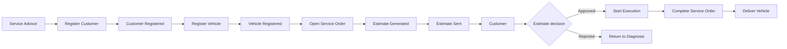

# Event Storming — fluxo principal

Este registro sintetiza o fluxo implementado e deve ser refinado com a oficina durante uma sessão de Event Storming.

Para melhor visualização, o fluxo também está disponível no [quadro no Miro](https://miro.com/app/board/uXjVH2t1UaA=/).

| Comando | Evento/resultado | Política |
|---|---|---|
| `OpenServiceOrder` | OS criada e orçamento gerado | Move a OS para `AWAITING_APPROVAL`. |
| `DecideEstimate` | Aprovação ou recusa registrada | Aprovação move para `IN_PROGRESS`; recusa retorna para `UNDER_DIAGNOSIS`. |
| `UpdateServiceOrderStatus(COMPLETED)` | OS finalizada | Só é aceito durante execução. |
| `UpdateServiceOrderStatus(DELIVERED)` | Veículo entregue | Só é aceito após finalização. |
| `ReplenishStock`, `ReserveStock`, `WithdrawStock` | Estoque alterado | A quantidade nunca pode ficar negativa. |

Pontos a validar com o domínio: prazo de expiração do orçamento, processo de reparo adicional, integração de baixa de estoque com a OS e canal real de notificação ao cliente.
