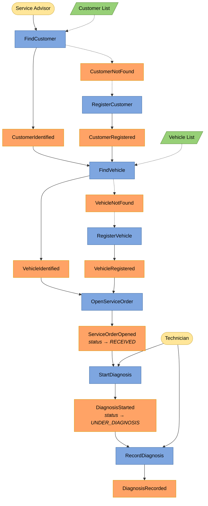
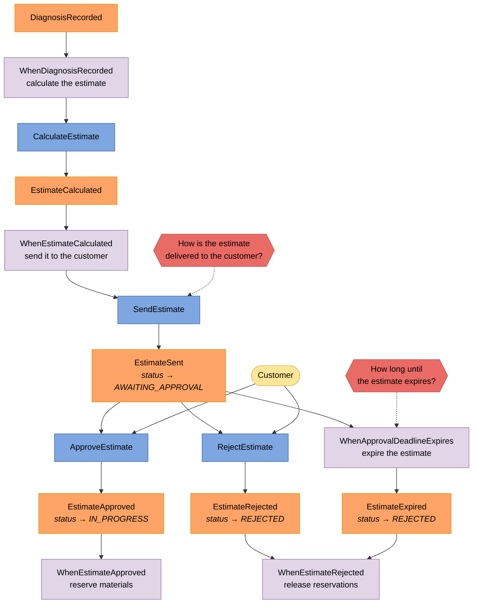
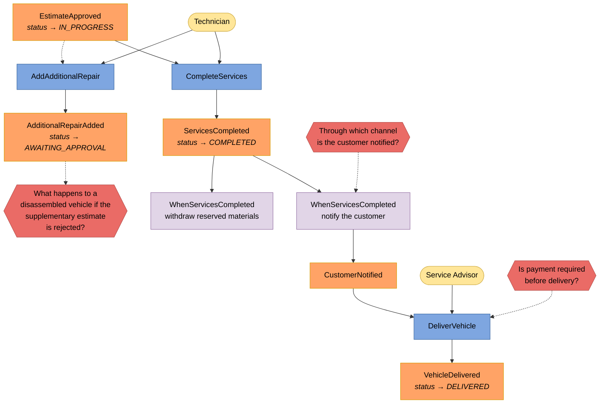
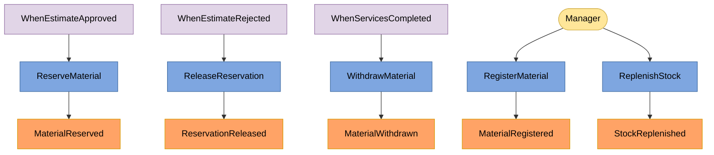

# Event Storming — SINATES

Notação conforme BRANDOLINI, A. *Introducing EventStorming*. Nível 3 (*Software Design*): as raias representam **agregados**, não módulos.

**Nota de método:** Event Storming é formato de workshop. Este quadro foi elaborado pelo grupo a partir do enunciado, sem sessão com especialista do domínio. Os pontos quentes marcam onde falta essa validação.

## Legenda

| Cor | Elemento | Convenção de nome |
|---|---|---|
| 🟨 Amarelo claro | Ator | substantivo |
| 🟦 Azul | Comando | verbo no imperativo |
| 🟧 Laranja | Evento de domínio | particípio passado |
| 🟪 Roxo | Política | "sempre que… então…" |
| 🟩 Verde | Read model | substantivo |
| 🟥 Vermelho | Ponto quente | pergunta em aberto |

Mudanças de status **não são comandos nem eventos** — são estado interno do agregado, anotadas junto ao evento que as provoca.

---

## Fluxo principal — abertura e diagnóstico

`CustomerNotFound` e `VehicleNotFound` estão desenhados como eventos por fidelidade ao quadro original do grupo, mas **não são eventos de domínio** — nada muda no mundo quando uma busca não encontra. No nível de código são retorno vazio de read model.

---

## Núcleo — orçamento e portão da aprovação

`CalculateEstimate` e `SendEstimate` aparecem como comandos disparados por política, não por ator. O enunciado diz que o orçamento é *"gerado automaticamente"* — logo ninguém o dispara à mão.

---

## Execução, entrega e reparo adicional

`AddAdditionalRepair` é o **único retrocesso do quadro**: a OS volta de `IN_PROGRESS` para `AWAITING_APPROVAL`. Todo o restante é linear.

---

## Agregado Inventory

`Inventory` é agregado separado de `ServiceOrder` porque a consistência entre eles tolera atraso: se a reserva sair segundos depois da aprovação, o pior caso é uma peça a menos disponível por segundos. A ligação é feita por política, nunca por chamada direta.

---

## Agregados e fronteiras

| Agregado | Contém | Justificativa da fronteira |
|---|---|---|
| `ServiceOrder` | Diagnosis, Estimate, ServiceLineItem, MaterialLineItem, StatusHistory | A invariante "nenhum serviço executado sem aprovação registrada" não tolera janela de inconsistência |
| `Customer` | TaxId | Ciclo de vida próprio, existe sem OS |
| `Vehicle` | LicensePlate | Ciclo de vida próprio, sobrevive a múltiplas OS e a troca de dono |
| `Inventory` | InventoryItem, Reservation | Consistência eventual aceitável com `ServiceOrder` |

`Estimate` é entidade **interna** a `ServiceOrder`, não raiz própria. Migra para agregado próprio se surgir cotação sem OS associada, se a contenção entre aprovação e lançamento se tornar mensurável, ou se a retenção do orçamento passar a exceder a da OS.

---

## Pontos quentes

| # | Pergunta | Impacto |
|---|---|---|
| HS1 | Por qual canal o orçamento chega ao cliente? | Define se há integração externa |
| HS2 | Qual o prazo até o orçamento expirar? | Reserva sem prazo trava estoque indefinidamente |
| HS3 | O que acontece com veículo desmontado se o complementar for recusado? | Sem resposta, o retrocesso do fluxo fica indefinido |
| HS4 | Por qual canal o cliente é notificado da conclusão? | Idem HS1 |
| HS5 | Há pagamento antes da entrega? | O enunciado não menciona dinheiro trocando de mãos |
| HS6 | "Aprovação" e "autorização" são o mesmo ato? | O cliente citou os dois separadamente na descrição da dor |
| HS7 | A remoção de veículo atende a dois atos com base legal distinta? | A base legal muda o que precisa ser provado depois, e a trilha atual não distingue |

**HS7 em detalhe.** `RemoveVehicle` cobre hoje duas situações que só se parecem na superfície. Na primeira, a oficina limpa o cadastro de um veículo que não atende mais: decisão administrativa dela, sem titular envolvido. Na segunda, o titular exerce o direito de eliminação do dado pessoal (LGPD Art. 18 VI): pedido dele, com prazo de resposta e dever de comprovação por parte da oficina.

As duas terminam na mesma anonimização, e é isso que torna aceitável tratá-las como um caso de uso único no MVP. Mas a base legal é diferente, e a trilha de auditoria registra apenas que o veículo foi removido — não a pedido de quem, nem sob qual fundamento. Se o titular questionar o atendimento do pedido, o registro atual não serve de prova. Separar os dois atos, quando for a hora, significa dois comandos distintos e um campo de fundamento na trilha, não um `boolean`.
